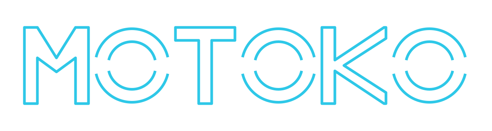

<p align="center">
  
</p>

# MOTOKO

> Shirow Masamune《攻殻機動隊》, Oshii Mamoru *Ghost in the Shell* (1995) —
> prosthetic shells, and the ghost that is not in any of them

**MOTOKO** is the philosophical and orchestration foundation of a
single-host, IM-commanded pentest composition. It asks the prior question:
*why does assembling every scanner still fail to produce an agent, and what
kind of remainder appears when the parts are bound as a graph?*

It does not prescribe a merged tree. Each shell keeps its own upstream
repository. The name is a callsign, not a character.

The one engineering claim is **agent re-orchestration**: existing agents and
scanners, bound as a graph, with interrupts where a human or a scope gate
must speak. A complete agent is the citation graph, not a vendor directory.
The ghost, if the question is even well-posed, is not in any shell.

- [GHOST.md](GHOST.md) — prosthetic shells vs ghost
- [GRAPH.md](GRAPH.md) — re-orchestration contract (nodes, edges, interrupts)
- [IMPLEMENTATION.md](IMPLEMENTATION.md) — contract vs private-engine status matrix
- [INSTRUMENTS.md](INSTRUMENTS.md) — citation map; each shell is a different repo

This repository carries the ontology, the re-orchestration contract,
and the engine that implements the contract's core — exported one-way
from the upstream private runtime. The engine is stdlib-only Python;
live scheduling state, operator profiles, campaign data, and tool
binaries are not part of this tree. The IM display name may wear the
callsign; that still does not put a ghost in this repo.

## The Theseus problem

Replace the body, keep the question. Hermes, Strix, Nuclei, Kali,
ProjectDiscovery recon, LangGraph — that is inventory. Inventory does not
authorize itself, does not refuse a destructive edge, and does not hash
evidence. Those remainders are the only places a ghost is even allowed
to appear.

Stand Alone Complex: a pattern can act without a master copy. A MOTOKO run
is that kind of pattern — nodes firing in a graph — not a binary named Motoko.

## Instruments

MOTOKO names the problem and the graph. It does not merge the instruments:

- **Runtime shell** — [Hermes Agent](https://github.com/NousResearch/hermes-agent):
  IM in, tools out. Invoker of the graph, not a node inside it.
- **Offensive cognition** — [Strix](https://github.com/usestrix/strix):
  proof-seeking pentest agent.
- **Reflex and sense** — [Nuclei](https://github.com/projectdiscovery/nuclei),
  ProjectDiscovery recon (katana, subfinder, httpx, and kin), Kali playbooks.
- **Connective tissue** — [LangGraph](https://github.com/langchain-ai/langgraph)
  names nodes, edges, and interrupts so the composition is inspectable.
  Live scheduling today is the operator-profile motoko skill; this repo
  does not ship a compiled graph.

The instruments may be composed on one host. Their licenses and release
cycles remain separate. See [INSTRUMENTS.md](INSTRUMENTS.md) and [NOTICE](NOTICE).

## What this is not

- Not a monorepo of those source trees.
- Not a new scanner and not a new agent runtime.
- Not a copyrighted character, voice, likeness, or mark. The wordmark in
  `logo/` is original lettering.
- Not a license to copy Shirow/Oshii. Named works are cited as a problem,
  the way one cites a film for a question it poses, not as a character to play.

## Layout

| Path | Content |
|---|---|
| `GHOST.md` | Ghost/shell ontology; why the agent is an orchestration |
| `GRAPH.md` | LangGraph contract: state, nodes, interrupts |
| `IMPLEMENTATION.md` | Contract primitives vs shipped-engine status |
| `INSTRUMENTS.md` | Upstream citations; license of each shell |
| `engine/` | The orchestration engine (see `engine/` quickstart below) |
| `NOTICE` | This work vs cited instruments |
| `AGENTS.md` | Contributor rules |
| `logo/` | Project wordmark. Master: `motoko-wordmark.svg` (transparent). |

## Engine quickstart

```bash
cd engine
make test        # 420+ tests, stdlib-only, Python >= 3.11
uv pip install -e .   # or: pip install . — provides the `motoko` CLI

motoko init demo-1 --scope example.com --seed https://example.com
motoko run demo-1 --max-cycles 3
motoko digest demo-1
motoko seal demo-1    # WAL checkpoint + integrity gates + manifest
```

Endpoints for the optional LLM reflector and wave-loop arrive via
environment variables and a config file (`docs/loop.yaml.example`);
keys are referenced by variable name, never stored. Tool resolution
follows `MOTOKO_TOOLS` → package-adjacent `tools/` → `~/.local/bin`
→ `PATH`.

## License

Original files in this repository are under the
[PolyForm Noncommercial License 1.0.0](https://polyformproject.org/licenses/noncommercial/1.0.0).
See `LICENSE` and `NOTICE`.

Permitted: personal study, hobby, research, and use by charitable /
educational / public-research / government institutions. **Commercial use
is not permitted.** This is source-available, not OSI Open Source, and not
a GNU license.

**Cannot be done to instruments:** this ontology cannot relicense Hermes Agent
(MIT), Nuclei (MIT), Strix (Apache-2.0), or LangGraph (MIT). Citing a shell
is not combining it. Those instruments still allow commercial use under
*their* terms.

## Cultural anchors

- Shirow Masamune《攻殻機動隊》— prosthetic body, cyberbrain, the ghost question
- Oshii Mamoru *Ghost in the Shell* (1995), *Innocence* (2004)
- *Stand Alone Complex* — copies without an original
